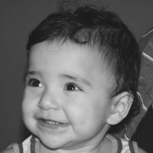

Bruna Soares \<<brunaeloisa7@gmail.com>\>  
André Varela \<<andre.varela.104@ufrn.edu.br>\>

 

## 1ª Unidade

### 2.2. Exercícios

* Utilizando o programa exemplos/pixels.cpp como referência, implemente um programa regions.cpp. Esse programa deverá solicitar ao usuário as coordenadas de dois pontos P1 e P2 localizados dentro dos limites do tamanho da imagem e exibir que lhe for fornecida. Entretanto, a região definida pelo retângulo de vértices opostos definidos pelos pontos P1 e P2 será exibida com o negativo da imagem na região correspondente. O efeito é ilustrado na Figura 4.

* Utilizando o programa exemplos/pixels.cpp como referência, implemente um programa trocaregioes.cpp. Seu programa deverá trocar os quadrantes em diagonal na imagem. Explore o uso da classe Mat e seus construtores para criar as regiões que serão trocadas. O efeito é ilustrado na Figura 5.

### 3.2. Exercícios

### 4.2. Exercícios
